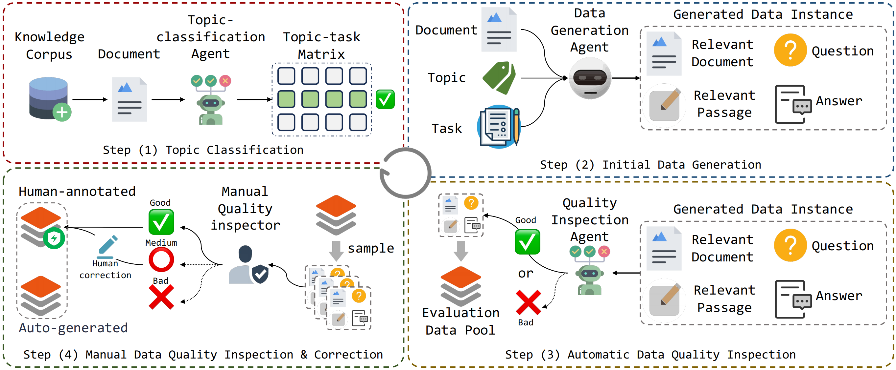

# <div align="center">OmniEval: Omnidirectional and Automatic RAG Evaluation Benchmark in Financial Domain<div>


<div align="center">
<!-- <a href="https://arxiv.org/abs/2405.13576" target="_blank"></a> -->
<!-- <a href="https://huggingface.co/datasets/RUC-NLPIR/FlashRAG_datasets/" target="_blank"></a> -->
<!-- <a href="https://huggingface.co/ShootingWong/OmniEval-ModelEvaluator" target="_blank"></a> -->
<!-- <a href="https://huggingface.co/ShootingWong/OmniEval-HallucinationEvaluator" target="_blank"></a> -->
<a href="https://huggingface.co/datasets/RUC-NLPIR/FlashRAG_datasets/" target="_blank"></a>
<a href="https://huggingface.co/ShootingWong/OmniEval-ModelEvaluator" target="_blank"></a>
<a href="https://huggingface.co/ShootingWong/OmniEval-HallucinationEvaluator" target="_blank"></a>
<a href="https://huggingface.co/spaces/NLPIR-RAG/OmniEval" target="_blank"></a>
<a href="https://github.com/RUC-NLPIR/FlashRAG/blob/main/LICENSE"></a>
<a></a>
</div>

<!-- [](https://huggingface.co/spaces/Vchitect/VBench_Leaderboard) -->

<h4 align="center">

<p>
<a href="#wrench-installation">Installation</a> |
<!-- <a href="#sparkles-features">Features</a> | -->
<a href="#rocket-quick-start">Quick-Start</a> | 
<a href="#bookmark-license">License</a> | 
<a href="#star2-citation">Citation</a>

</p>

</h4>

<p align="center">

</p>
<!-- 
With FlashRAG and provided resources, you can effortlessly reproduce existing SOTA works in the RAG domain or implement your custom RAG processes and components. -->


## :wrench: Installation
`conda env create -f environment.yml && conda activate finrag`

<!-- ## :sparkles: Features
1. -->
## :rocket: Quick-Start
Notion:
1. The code run path is `./OpenFinBench`
2. We provide our auto-generated evaluation dataset in <a href="https://huggingface.co/datasets/RUC-NLPIR/FlashRAG_datasets/" target="_blank"></a>
### 1. Build the Retrieval Corpus
```
# cd OpenFinBench
sh corpus_builder/build_corpus.sh # Please see the annotation inner the bash file to set parameters.
```
### 2. Generate Evaluation Data Samples
1. Generate evaluation instances
```
# cd OpenFinBench
sh data_generator/generate_data.sh
```
2. Filter (quality inspection) evaluation instances
```
sh data_generator/generate_data_filter.sh
```
### 3. Inference Your Models
```
# cd OpenFinBench
sh evaluator/inference/rag_inference.sh 
```
### 4. Evaluate Your Models
#### (a) Rule-based Evaluation
```
# cd OpenFinBench
sh evaluator/judgement/judger.sh # by setting judge_type="rule"
```
#### (b) Model-based Evalution
We propose five model-based metric: accuracy, completeness, utilization, numerical_accuracy, and hallucination. We have trained two models from Qwen2.5-7B by the lora strategy and human-annotation labels to implement model-based evaluation. 

Note that the evaluator of hallucination is different from other four. Their model checkpoint can be load from the following huggingface links:
1. The evaluator for hallucination metric: <a href="https://huggingface.co/ShootingWong/OmniEval-HallucinationEvaluator" target="_blank"></a>
2. The evaluator for other metric: <a href="https://huggingface.co/ShootingWong/OmniEval-ModelEvaluator" target="_blank"></a>


To implement model-based evaluation, you can first set up two vllm servers by the following codes:
```
```

Then conduct the model-based evaluate using the following codes, (change the parameters inner the bash file).
```
sh evaluator/judgement/judger.sh 
``` 

## :bookmark: License

OmniEval is licensed under the [<u>MIT License</u>](./LICENSE).

## :star2: Citation
The paper is waiting to be released!

<!-- # Check Infos
## Pipeline
1. Build corpus
2. Data generation
3. RAG inference
4. Result evaluatioin

## Code
1. remove "baichuan"
2. remove useless annotation -->
